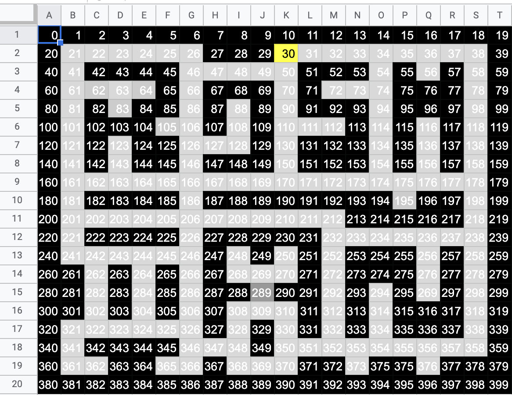
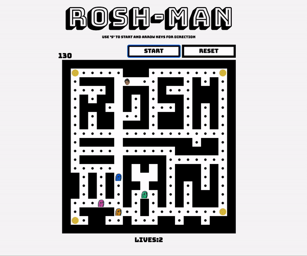
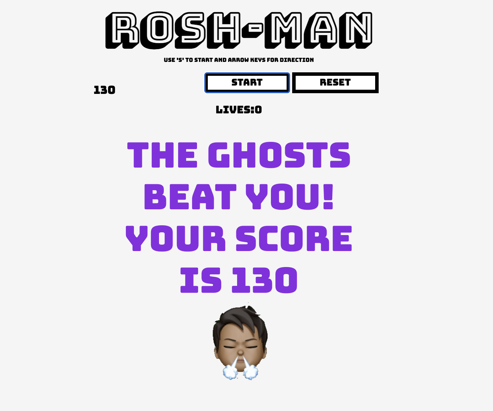

# Project 1 - **ROSH-MAN**

## **Overview**

This was the first project of the Software Engineering Immersive course with GA. It was a challenging and fun one-week solo project that really helped consolidate the first few weeks of class content.

Given a list of game options to recreate, I chose Pac-Man to challenge myself.

## The Brief

* The player should be able to clear at least one board
* The player's score should be displayed at the end of the game
* Responsive design (stretch goal)
 
## Technologies used

* JavaScript
* CSS
* HTML
* Git and GitHub

## Approach
Before beginning to write any code, I mapped the game out, including all the interactions and outcomes I'd need to consider.

### Layout of grid

I created grid as an array of cells, with classes applied to the cells which would be the walls of the maze, and those which would not.

To plan this, I created a numbered grid in Google Sheets with corresponding numbers so I could select those which were 'walls', with the others by default, becoming cells that ROSH-MAN and the ghosts could 'move around in'.

When creating the grid, I also added classes of 'food' and 'energizer'.

This approach allowed me to navigate the grid using -1, +1, -width or +width.

### Ghost movement

My inital approach to ghost movement was to generate and use random numbers to randomise the direction the ghosts moved. This proved problematic though as the ghost's behaviour was too random, especially when it could move along in a straight line, as per traditional versions of Pac-Man.

To overcome this, I added a class called 'moveAlong'. This class is added to every cell the ghost goes in, then is removed when as the ghost class is moved to the next cell.

This approach gives the ghost a smoother path around the board, but still keeps it's movement somewhat random.

With this method, I encountered using this method was that I initally used one 'moveAlong' class, and this caused the ghosts to get stuck if they passed over each other. I fixed this bug by having individual 'moveAlong' classes so they wouldn't clash with each other.

### Collisions

**Detecting**

There are checks in place for when ROSH-MAN and a ghost collide, this is when the class for pacman and the ghost class are on the same cell, and sends them back to their orginal positions.

**Timing** 🐜 🐛 🕷

The timing of the player and that of the ghost movement don't match so the player can 'skip' the ghost. I could improve this by creating a class, which is applied to the cells surrounding the ghost and would be counted as a collision.

### Grey ghost mode

When ROSH-MAN lands on an energizer, the ghosts go into grey mode for a set period of time. To do this, I used a boolean to check if they were in 'greyMode', adding this class on the cell that have the variable of the ghosts, and removing the original ghost class. A `setTimeout` then removes this class after a certain period of time. The grey ghost class is set to interact with the pacman class in a different way, but to have the same movement as a normal ghost.

### Game over

The game ends when either the lives equal 0 or when the food and engerizer counts are at 0. The game over message is a class which is hidden when either of those is not true.

### Stretch goal

A stretch goal for this project was to make the game responsive and mobile friendly. The game is mobile friendly, although the control buttons were an issue for clicking on multiple times, as this would make the browser automatically zoom in.

The first solution to this that I found was using the following: ` <meta name='viewport' content='width=device-width, initial-scale=1.0, maximum-scale=1.0, user-scalable=0' > `

Following some further research, I found that this has been phased out of use due to it preventing accessibility - as it prevents users from zooming in.

For ROSH-MAN, I used `touch action: none` in the CSS to prevent the zooming. This will be something I will look into further as I would like to find a way to overcome the zoom issue, but still allow some users to zoom where needed.

## Improvements to be made

* Refactor my code more - I was able to create a function to save repeated code within the ghost movement function however within that function, there are repeated sections that I could refactor further.
* Accessibility - I would would work on the zooming issue I mentioned in the 'Stretch Goal' section.

## Artwork and fonts
* The ghosts, and inspiration for theme, are from a ghost drawn by Roshan, my friend's 6 year-old nephew.
* ROSH-MAN is a Memoji created on an iPhone.
* The font family is from Google Fonts are part of the Bungee family.

